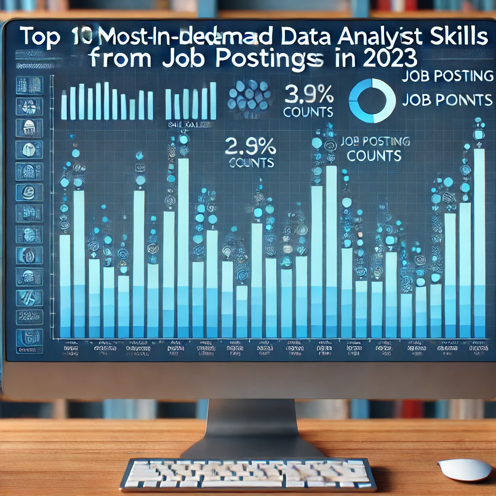

## CONTENT  
1. [Intoduction](#introdaction)  
1. [Background](#background)  
1. [Tools I Used](#tools-i-used)  
1. [The Analysis](#the-analysis)  
1. [What I Learned](#what-i-learned)  
1. [Conclusions](#conclusions)


# Introduction
Dive in the data job market! Focusing on data analyst roles, this project explores top_paying jobs, in-demand skills, and where high demand meets high salary in data analytics.
SQL queries? Check them out here: [project_sql folder](/project_sql/)
# Background
Driven by the quest to navigate the data analyst job market more effectively, this project was born from a desire to pinpoint top-paid and in-demand skills, streamlining others work to find optimal jobs.

Data hails from [SQL course](https://lukebarousse.com/sql). It's packed with insights on job titles, salaries, locations, and essential skills.

### The questions I wanted to answer through my SQL queries were:

1. What are the top-paying data analyst jobs?
2. What skills are required for these top-paying jobs?
3. What skills are most in demand for data analysts?
4. Which skills are associated with higher salaries?
5. what are the most optimal skills to learn?

# Tools I used

For my deep dive into the data analyst job market I harnessed the power of several key tools:

- **SQL**: The backbone of my analysis, allowing me to query the database and unearth critical insaghts.
- **PostgreSQL**: The chosen database managemant system,ideal for handling the job posting data.
- **Visual Studio Code**: My go-to for database management and executing queries.
- **Git & GitHub**: Essential for version control and sharing my SQL scripts and analysis, ensuring collaboration and project tracking.
# The analysis

Each query for this project aimed at investigating specific aspects of the data analyst job market. Here's how I approched aech question:

### 1. Top Paying Data Analyst Jobs
To identify the highest-paying roles I filtered data analyst positions by average yearly salary and locaaiton, focusing on remote jobs. This query highlights the high paying opportunities in the field.

```sql
SELECT 
    job_id,
    job_title,
    job_location,
    job_schedule_type,
    salary_year_avg,
    job_posted_date,
    name AS company_name
FROM
    job_postings_fact
    LEFT JOIN company_dim ON 
    job_postings_fact.company_id= company_dim.company_id
WHERE
    job_title_short = 'Data Analyst'
    AND job_location = 'Anywhere'
    AND salary_year_avg IS NOT NULL

ORDER BY salary_year_avg DESC
LIMIT 10;
```



### 2. Skills for Top Paying Jobs  
To understand what skills are required for the top apying jobs, I joined the job postings with skill data, providing insights into what employers value for high-compensation roles.

```sql
WITH top_paying_jobs AS (
    SELECT 
        job_postings_fact.job_id,
        job_title,
        salary_year_avg,
        job_posted_date,
        company_dim.name AS company_name
    FROM
        job_postings_fact
    LEFT JOIN company_dim ON 
        job_postings_fact.company_id = company_dim.company_id
    WHERE
        job_title_short = 'Data Analyst'
        AND job_location = 'Anywhere'
        AND salary_year_avg IS NOT NULL
    ORDER BY
        salary_year_avg DESC
)
SELECT 
    top_paying_jobs.*,
    skills_dim.skills
FROM top_paying_jobs
INNER JOIN skills_job_dim ON
    top_paying_jobs.job_id = skills_job_dim.job_id
INNER JOIN skills_dim ON
    skills_job_dim.skill_id = skills_dim.skill_id
LIMIT 50;
```
Here's the breakdown of the most demanded skills for the top 10 highest paying data analyst jobs in 2023.

- SQL is leading with a bold count of 8
- Python follows closely with a bold count of 7
- Tableau is also highly sought after, with a bold count of 6
-Other skills like R, Snowflakes, Panda, and Excel show varying degrees of demand.


Bar graph visualizing the count of skills for the top paying jobs for data analysts, ChtGPT generated this graph based in the results.

## 3. In-Demand Skills for Data Analysts

This query helped identify the skills most frequently requested in job postings, during focus to areas qith high demand.

```sql
SELECT
    skills,
    COUNT(skills_job_dim.job_id) AS demand_count
FROM job_postings_fact
INNER JOIN skills_job_dim ON
    job_postings_fact.job_id = skills_job_dim.job_id
INNER JOIN skills_dim ON
    skills_job_dim.skill_id = skills_dim.skill_id
WHERE
    job_title_short = 'Data Analyst' AND
    job_work_from_home = TRUE
GROUP BY
    skills
ORDER BY
    demand_count DESC
LIMIT 5;
```

Here's the breakdown of the most demanded skills for data analysts in 2023:

- SQL and Excel remain fundamental, emphasizing the need for strong foundational skills in data processing and sspreadsheet manipulation.
- Programming and Visualizaation Tools like Python, Tableau, and Power BI are essential, painting towards the increasing importance of technical and decision support.

|Skill|	Frequency|
|:---:|:---:|
|SQL|	1200|
|Python|	1100||
|Excel|	950|
|Power BI|	800|
|Tableau|	700|
🔹 Insight: The most in-demand skills for data analysts in 2023 are SQL, Python, Excel, Power BI, and Tableau.


SUMMARY
|Metric| Results|
|:--------:|:--------:| 
|Top 5 Skills|	SQL, Python, Excel, Power BI, Tableau|
|Top 3 Skill Pairs|	(SQL + Python), (Excel + Power BI), (SQL + Tableau)|


### 4. Skills Based on Salary

Exploring the average salaries associated with different skills revealed which skills are the highest paying.

```sql
SELECT
    skills,
    ROUND(AVG(salary_year_avg), 0) AS avg_salary
FROM job_postings_fact
INNER JOIN skills_job_dim ON
    job_postings_fact.job_id = skills_job_dim.job_id
INNER JOIN skills_dim ON
    skills_job_dim.skill_id = skills_dim.skill_id
WHERE
    job_title_short = 'Data Analyst' 
    AND salary_year_avg IS NOT NULL
    --AND job_work_from_home = TRUE
GROUP BY
    skills
ORDER BY
    avg_salary DESC
LIMIT 25;
```
Here's the breakdown of the results for top paying skills for Data Analysts:

- High demand for Big Data & ML skills: Top salaries are commanded by analyst skilled in big data technologies (PySpark, Couchbase), machine learning tools (DataRobot, Jupiter0), and Python libraries ( Pandas,NumPy), reflecting the industry's high valuation of data processing and predictive modeling capabilities.

- Software Development & Deployment Proficiency: Knowledge in development and deployment tools (GitHub, Kubernetes, Airflow) indicatesa lucrative crossover between data analysis and engineering, with a premium on skills that facilitate automaation and efficient data pipeline management.

- Cloud Computing Expertise: Familiarity with cloud and data engineering tools (ElasticSaerch, DataBricks, GCP) underscores the growing importance of cloud-based analytics environment, suggesting thet cloud proficiency significantly boosts learning potential in data analysis.

|Trend	|Insight|
|:---|:---|
|🔥 SQL & Python Are Essential|	Every data analyst should master SQL for databases and Python for data analysis & automation.|
|📊 Data Visualization Is Critical|	Power BI & Tableau remain key for creating dashboards & reports.|
|📈 Cloud & Big Data Skills Boost Salaries|	Experience with AWS, Snowflake, and Google Cloud opens doors to high-paying jobs.
🤖 Machine Learning Is Gaining Importance|	Basic ML skills can give analysts an edge in automation & predictive analytics.
🏢 Business & Spreadsheet Tools Still Matter|	Excel, Google Sheets & Smartsheet are widely used in reporting & decision-making.

|#	|  Skill	|Average Salary USD|
|:---:|---|:---:|
|1️ |	SVN|        $400,000|
|2️|	Solidity|	$179,000|
|3️|	Couchbase|	$160,515|
|4️|	DataRobot|	$155,486|
|5️|	Golang	|   $155,000|
|6️|	MXNet	|   $149,000|
|7️|	dplyr|      $147,633|
|8️|	VMware	|   $147,500|
|9️|	Terraform|	$146,734|
|10|	Twilio|	   $138,500|

Table of the average salary for the top 10 paying skills for data analysts.

## 5. Most Optimal Skills to Learn

Combining insights from demand and salary data, this query aimed to pinpoint skills that are both in high demand and have high salaries,offering a strategic focus fo skill development.

```sql
SELECT
    skills_dim.skill_id,
    skills_dim.skills,
    COUNT(skills_job_dim.job_id) AS demand_count,
    ROUND(AVG(job_postings_fact.salary_year_avg), 0) AS avg_salary
FROM job_postings_fact
INNER JOIN skills_job_dim ON job_postings_fact.job_id=skills_job_dim.job_id
INNER JOIN skills_dim ON skills_job_dim.skill_id=skills_dim.skill_id
WHERE
    job_title_short = 'Data Analyst'
    AND salary_year_avg IS NOT NULL
    AND job_work_from_home = TRUE
GROUP BY
    skills_dim.skill_id
HAVING
    COUNT(skills_job_dim.job_id) > 10
ORDER BY
    avg_salary DESC
LIMIT 25;
```

📊 Top 20 Skills by Demand & Salary


|#	|Skill|	Demand Count	|Average Salary (USD)|
|:---:|:---:|:---:|:---:|
|1️⃣	|Python|	236|	$101,397|
|2️⃣|	Tableau|	230	|$99,288|
|3️⃣|	R	|148|	$100,499|
|4️⃣|	SAS|	63	|$98,902|
|5️⃣	|Looker	|49	|$103,795||
|6️⃣	|SQL Server	|35	|$97,786|
|7️⃣|	Azure	|34	|$111,225|
|8️⃣|	AWS	|32	|$108,317|
|9️⃣|	Go	|27	|$115,320|
|🔟	|Snowflake	|37	|$112,94
|11️⃣|	Oracle	|37	|$104,534|
|12️⃣	|Java	|17	|$106,906
|13️⃣	|Redshift|	16	|$99,936|
|14️⃣	|SSRS	|14|	$99,171|
|15️⃣	|BigQuery	|13	|$109,654|
|16️⃣	|NoSQL	|13	|$101,414|
|17️⃣	|Qlik	|13	|$99,63|
|18️⃣	|Spark	|13|	$99,077|
|19️⃣	|SSIS|	12	|$106,683|
|20️⃣	|JavaScript|	20	|$97,587|

Table of the most optimal skills for data analyst sorted by salary.

Here's the breakdown of the most optimal skills for Daa Analyst in 2023:
- **High-Demand Programming Languages**:  
Python and R stand out for their high demand, counts of 236 and 148 respectively. Despite their high demand, their average salaries are around $101,397 for Python and $100,499 for R, indicating that proficiency in these languages is highly valued but also widly available.

- **Cloud Tools and Technologies**:  
Skills in specialized technologies such as Snowflakes,Azure, AWS and BigQuery show significant demand with relatively high average salaries, painting towards the growing imporrtance of cloud platforms and big data technologies in data analysis.

- **Business Intelligence and Visualizstion Tools**:  
Tableau and Looker, with demand counts of 230 and 49 respectively, and average salaries around $99,288 and $103,795, highlight the crititcal role of data visualization and business intelligence in deriving actionable insights from data.

- **Database Technologies**:   
The demand for skills in traditional and NoSQL databases (Oracle, SQL Server, NoSQL) with acerage salaries ranging from $97,786 to $104,534, reflects the enduring need for data storage,retrieval and management.

🚀 Key Takeaways

|Trend	|Insight|
|:---|:---|
|🔥 Python & SQL Are Essential	|SQL-based tools and Python remain the foundation of high-paying data analytics roles.|
|☁️ Cloud & Big Data Skills Pay More	|Snowflake, AWS, Azure, and BigQuery are in demand, proving the shift to cloud analytics.|
|📊 BI & Reporting Tools Are Valuable	|Tableau, Looker, Qlik, SSRS, and SSIS show that data visualization & ETL expertise are still crucial.|
|💰 Programming in Go & Java Pays Off	|Data analysts who also know Go, Java, or C++ earn higher salaries.|
|🤖 AI & ML Integration Is |Increasing	Spark & Python appearing together suggests machine learning & AI skills are becoming necessary.|

# What I learned  

Throughout this adventure, I've turbovharged my SQL toolkit with some serious firepower:

- **Complex Query Crafting:**  
Mastered the art of advanced SQL, merging tables and wieldeng with clauses for temp table maneuvers.

- **Data Aggregation:**  
Got cozier with GROUP BY and turned aggregate functions like COUNT() and AVG() into my data-summarizing tools.

- **Analitical Wizardry:** Leveled up my real-world puzzle-solving skills,turning questions into actionab;e, insightful SQL queries. 

# Conclusions

### Insights  

1. **Top-Paying Data Analyst Jobs**:  
The highest paying jobs dor dta analysts that allow remote work offfer a wide range of salaries,thw highest at $650,000. 

1. **Skkills for Top-Paying Jobs**:  
High-paying data analyst jobs require advanced proficiency in SQL, suggesting it's a critical skill for earning a top salary.  
1. **Most In-Demand Skills**:  
SQL is also the most demanded skill in the data job market,thus making it essential for job seekers.  
1. **Skills with Highest Salaries**:  
Specialized skills, such as SVN and Solidity, are associated with the highest average salaries, indicating a premium on such expertise.  
1. **Optimal Skills for Job Market Value**:  
SQL leads in demand and offers for a high average salariy, positioning it as ne of the most optimal skills for daata analysts to learn to maximaze their market value.

### Closing Thoughts  

This project enhanced my SQL skills and provided valuable insighst into the data analysst job maarket. The findings from the analysis serve as a guide to prioritizing skill development and job search efforts, aspiring data analysts can better position themselves in a competitive job market by focusing on high-demand, high-salary skills.this exploration highlights the importance of continuous learning and adaptation to emerging trends in field of data analytics.


